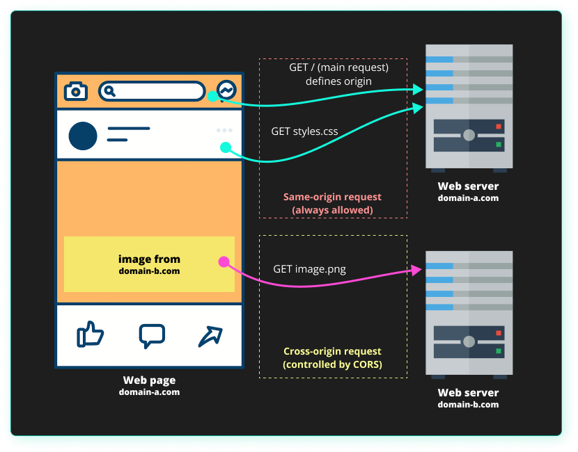

# 🚀 preflight-request-proxy

[](https://github.com/barbhackk/preflight-request-proxy "Go to GitHub repo")
[](https://img.shields.io/badge/langage-javascript-blue?logo=javascript)
[](#license)
[](https://github.com/barbhackk/preflight-request-proxy/issues)
[](https://github.com/barbhackk/preflight-request-proxy)
[](https://github.com/barbhackk/preflight-request-proxy)

Proxy a CORS preflight request

> [!IMPORTANT]  
> Use this tool only for your development.

# 🔨 Description

Browsers implementing a same-origin policy prevent website scripts served on one origin from making requests to another origin using methods such as XMLHttpRequest or the Fetch API.
There are cases of exceptions but from the moment we touch the header of a request: “Accept”, “Content-Type”, “Authorization”… the policy is applied.

> Cross-Origin Resource Sharing (CORS) is an HTTP-header based mechanism that allows a server to indicate any origins (domain, scheme, or port) other than its own from which a browser should permit loading resources. CORS also relies on a mechanism by which browsers make a "preflight" request to the server hosting the cross-origin resource, in order to check that the server will permit the actual request. In that preflight, the browser sends headers that indicate the HTTP method and headers that will be used in the actual request.
>
> https://developer.mozilla.org/fr/docs/Web/HTTP/CORS

For security reasons, multi-origin HTTP requests issued from scripts are restricted by the browser.
The browser considers two URLs to be of the same origin if they have the same scheme, domain and port number (if the URL includes a port).

<p align="center">
    
</p>

A pre-check request is automatically sent by the browser when necessary.

A CORS cross-origin pre-check request is a verification request made to check whether the CORS protocol is authorized.
It is a request using the OPTIONS method that uses three HTTP headers: The Access-Control-Request-Method, the Access-Control-Request-Headers and Origin headers.

# 🔥 Usage

npm run start -- --help

```
Preflight request proxy

  If you want to use the local development environment with the dev
  backend,this will create a proxy so you won't run into CORS issues.It accepts
  the following command line parameters:
   - Port : the port where the proxy will listen
   - Target : the DEV backend target to contact.

  Example: If you set the port to 3000 and target to http://localhost:45680
  thenyour actual "resourceBaseUrl" in setting should be
  http://localhost:3000/api/v1

Options

  -p, --port number     The listened port au reverse proxy. By default port
                        3000 is used.
  -t, --target string   The targeted URL (for exemple your local API,
                        http://127.0.0.1:8001). By default
                        http://127.0.0.1:8000 is used.
  --help string         Print this usage guide.

  Project write by Sébastien DOUTRE: https://github.com/barbhackk
```

## 💪 Basic usage

For use http://localhost:45469 TO http://localhost:99898

`npm run start -- -p 45469 -t http://localhost:99898`

The reverse proxy will now respond to preliminary requests that say the API can communicate with localhost:99898.

# ❤️ Contributing

1. Fork it (https://github.com/sr6033/lterm/fork)
2. Create your feature branch (git checkout -b feature/fooBar)
3. Commit your changes (git commit -am 'Add some fooBar')
4. Push to the branch (git push origin feature/fooBar)
5. Create a new Pull Request

### 🐛 Bug Reports & Feature Requests
Please use the [issue](https://github.com/barbhackk/preflight-request-proxy/issues) tracker to report any bugs or file feature requests.
